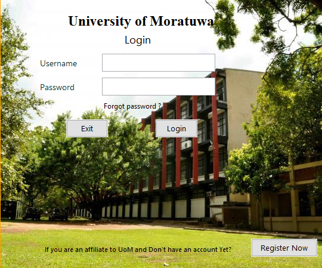
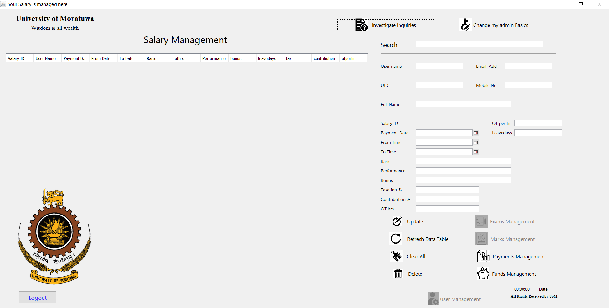

# University-Administrative-System-using-Java
This project was conducted as a partial fulfillment of the course: Certified Professional in Java and SQL by the Pace Institute, Pannipitiya, Sri Lanka. This simple university administrative system was developed using Java Netbeans IDE and and further, this project and/or its any content has no official affiliation with the University of Moratuwa, Sri Lanka.  

  
Figure 1: Login page of the developed management system

Figure 3: Management Page of an admin user in the system
